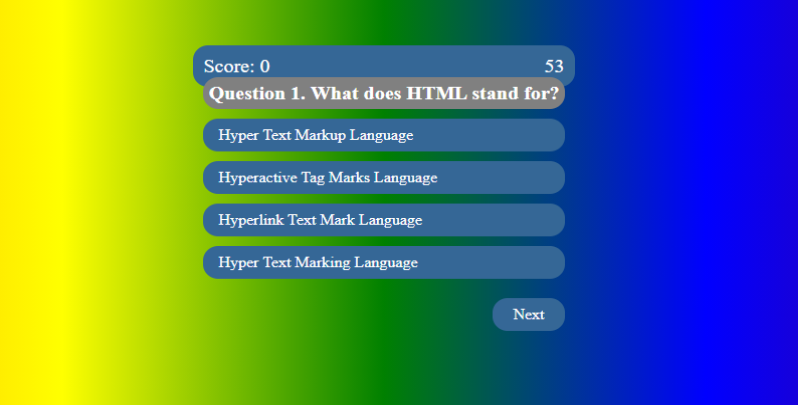

Your## interactive quiz

criteria:
as a client
WHEN I click the start button
THEN a timer starts and I am presented with a question
WHEN I answer a question
THEN I am presented with another question
WHEN I answer a question incorrectly
THEN time is subtracted from the clock
WHEN all questions are answered or the timer reaches 0
THEN the game is over
WHEN the game is over
THEN I can save my initials and my score

## 

Make content relavent to courswork/recover previous work. Lost starting over

# starting the HTML

some divs here and there
css and js need to be squared away
sketch out, keep it simple.

# button html
research more about hidden button code tags
get creative with the hidden index
creat start button link

## css
worked out a skel when done
*Fix later

## JavaScript - appending cards
working on changing quesitons
start button timer
associated ids and classes - for css-  need to be worked out.
questions created 
timer - study - basic timer set up 
todo- the time subtraction when answered incorrectly 

## final results card
card set up - working on reveal todo 

## submit button for initials
I should add a submit button
how would I go about doing this with actual functionality?
Maybe just log initials  - save unitl code functions as well

# final todos - 
css - initials input

